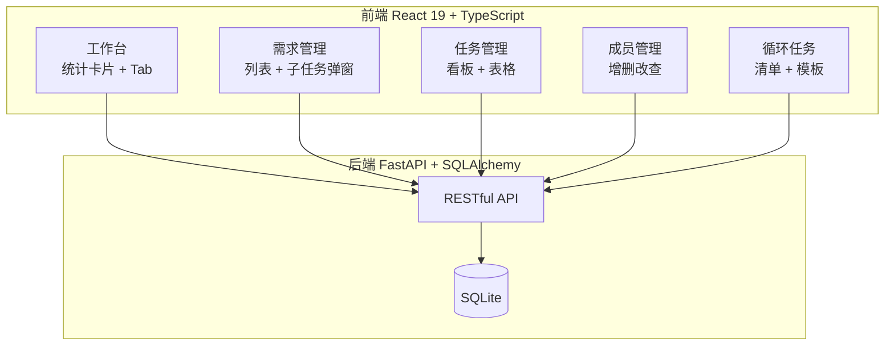
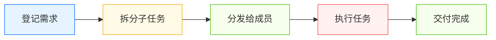
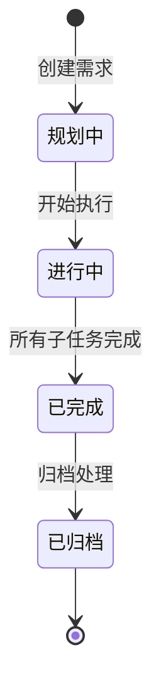
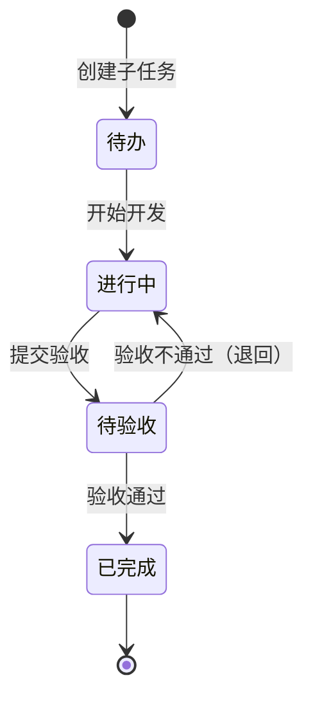
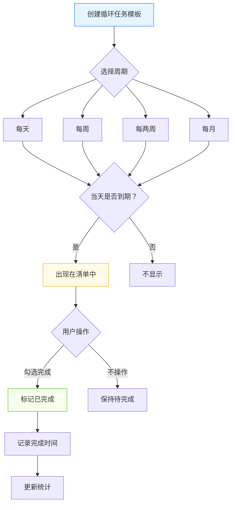
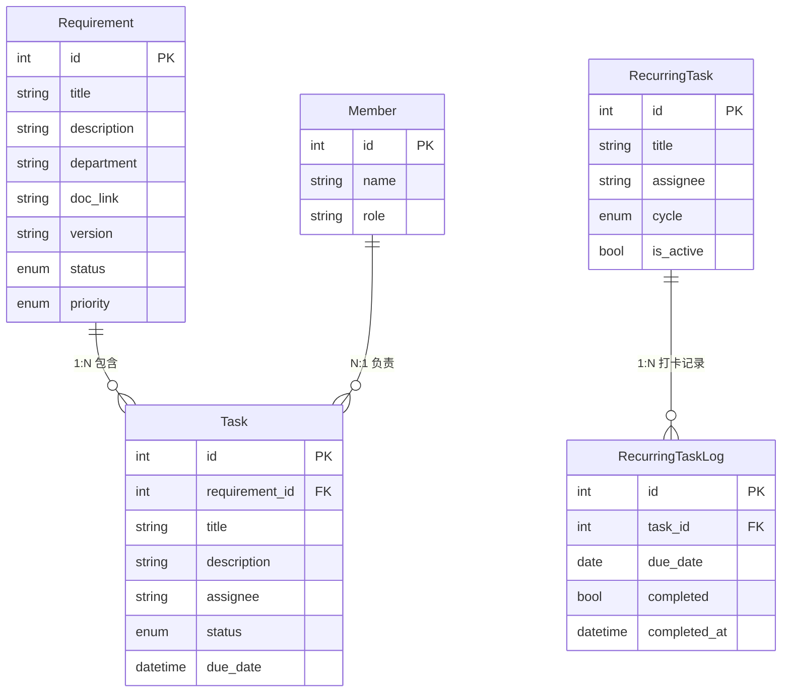
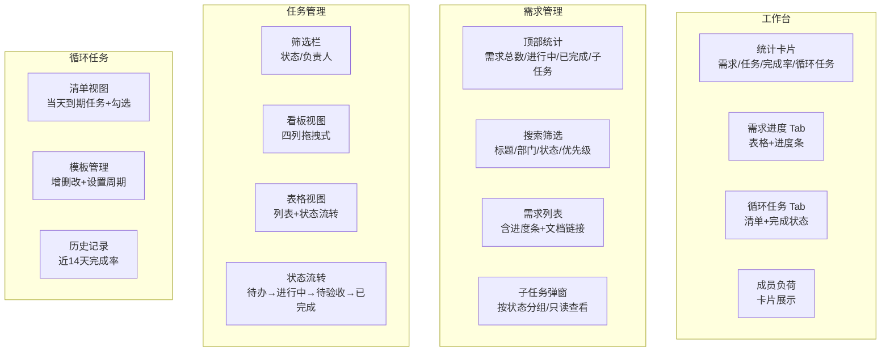

# 任务与需求管理系统 - 流程图

## 一、系统架构总览

```mermaid
graph TB
    subgraph Frontend["前端 React 19 + TypeScript"]
        Dashboard["工作台<br/>统计卡片 + Tab"]
        ReqList["需求管理<br/>列表 + 子任务弹窗"]
        TaskList["任务管理<br/>看板 + 表格"]
        MemberMgmt["成员管理<br/>增删改查"]
        Recurring["循环任务<br/>清单 + 模板"]
    end

    subgraph Backend["后端 FastAPI + SQLAlchemy"]
        API["RESTful API"]
        DB[(SQLite)]
    end

    Dashboard --> API
    ReqList --> API
    TaskList --> API
    MemberMgmt --> API
    Recurring --> API
    API --> DB
```

## 二、核心业务流程

```mermaid
flowchart LR
    A["登记需求"] --> B["拆分子任务"]
    B --> C["分发给成员"]
    C --> D["执行任务"]
    D --> E["交付完成"]

    style A fill:#e6f4ff,stroke:#1677ff
    style B fill:#fffbe6,stroke:#faad14
    style C fill:#f6ffed,stroke:#52c41a
    style D fill:#fff1f0,stroke:#ff4d4f
    style E fill:#f6ffed,stroke:#52c41a
```

## 三、需求生命周期

```mermaid
stateDiagram-v2
    [*] --> 规划中 : 创建需求
    规划中 --> 进行中 : 开始执行
    进行中 --> 已完成 : 所有子任务完成
    已完成 --> 已归档 : 归档处理
    已归档 --> [*]
```

## 四、任务状态流转

```mermaid
stateDiagram-v2
    [*] --> 待办 : 创建子任务
    待办 --> 进行中 : 开始开发
    进行中 --> 待验收 : 提交验收
    待验收 --> 已完成 : 验收通过
    待验收 --> 进行中 : 验收不通过（退回）
    已完成 --> [*]
```

> 需求管理页面只做查看，不触发状态变更。
> 状态变更在「任务管理」页面操作。

## 五、循环任务流程

```mermaid
flowchart TD
    A["创建循环任务模板"] --> B{"选择周期"}
    B --> C["每天"]
    B --> D["每周"]
    B --> E["每两周"]
    B --> F["每月"]

    C --> G{"当天是否到期？"}
    D --> G
    E --> G
    F --> G

    G -->|是| H["出现在清单中"]
    G -->|否| I["不显示"]

    H --> J{"用户操作"}
    J -->|勾选完成| K["标记已完成"]
    J -->|不操作| L["保持待完成"]

    K --> M["记录完成时间"]
    M --> N["更新统计"]

    style A fill:#e6f4ff,stroke:#1677ff
    style H fill:#fffbe6,stroke:#faad14
    style K fill:#f6ffed,stroke:#52c41a
```

## 六、数据模型关系

```mermaid
erDiagram
    Requirement ||--o{ Task : "1:N 包含"
    Member ||--o{ Task : "N:1 负责"
    RecurringTask ||--o{ RecurringTaskLog : "1:N 打卡记录"

    Requirement {
        int id PK
        string title
        string description
        string department
        string doc_link
        string version
        enum status
        enum priority
    }

    Task {
        int id PK
        int requirement_id FK
        string title
        string description
        string assignee
        enum status
        datetime due_date
    }

    Member {
        int id PK
        string name
        string role
    }

    RecurringTask {
        int id PK
        string title
        string assignee
        enum cycle
        bool is_active
    }

    RecurringTaskLog {
        int id PK
        int task_id FK
        date due_date
        bool completed
        datetime completed_at
    }
```

## 七、页面功能矩阵

```mermaid
graph TB
    subgraph 工作台
        D1["统计卡片<br/>需求/任务/完成率/循环任务"]
        D2["需求进度 Tab<br/>表格+进度条"]
        D3["循环任务 Tab<br/>清单+完成状态"]
        D4["成员负荷<br/>卡片展示"]
    end

    subgraph 需求管理
        R1["顶部统计<br/>需求总数/进行中/已完成/子任务"]
        R2["搜索筛选<br/>标题/部门/状态/优先级"]
        R3["需求列表<br/>含进度条+文档链接"]
        R4["子任务弹窗<br/>按状态分组/只读查看"]
    end

    subgraph 任务管理
        T1["筛选栏<br/>状态/负责人"]
        T2["看板视图<br/>四列拖拽式"]
        T3["表格视图<br/>列表+状态流转"]
        T4["状态流转<br/>待办→进行中→待验收→已完成"]
    end

    subgraph 循环任务
        C1["清单视图<br/>当天到期任务+勾选"]
        C2["模板管理<br/>增删改+设置周期"]
        C3["历史记录<br/>近14天完成率"]
    end
```
